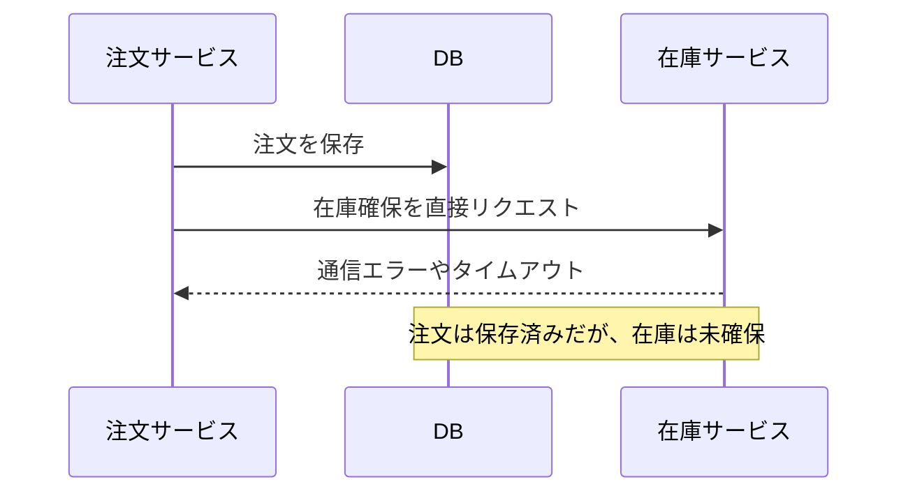
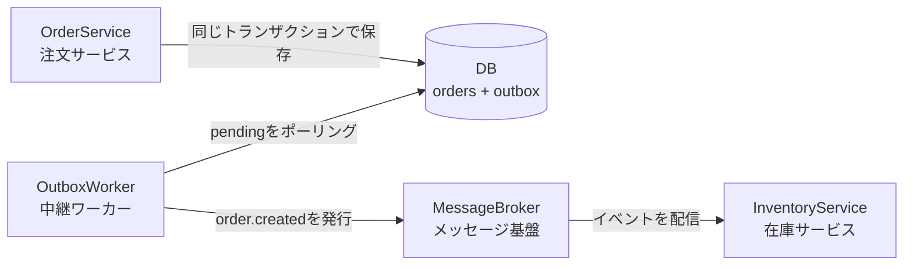
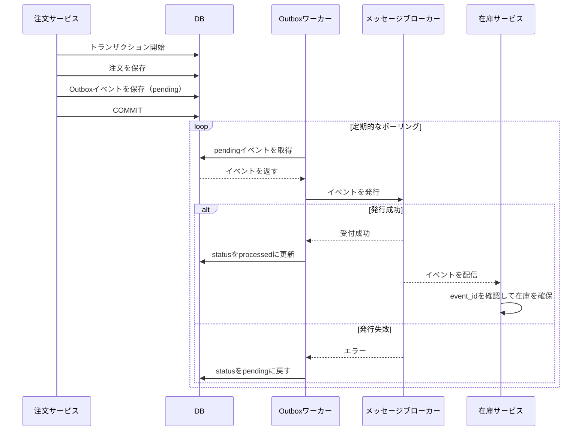
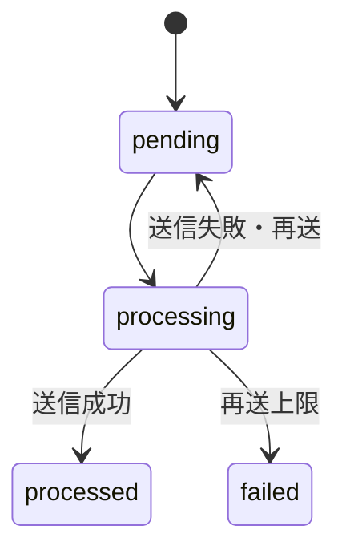

職場でマイクロサービス間の通信でOutbox パターンというものが使われています。
しかし私はなんとなくしか理解ができていないので、今回手を動かして学ぼうと思います。

この記事では、最小限の Ruby コードに置き換えて、Outbox パターンの基本を整理します。

## 本題
マイクロサービスや外部メッセージングを使うシステムでは、DBの更新とイベントの送信を同時に成功させたい場面があります。

注文サービスと在庫サービスが別々に動いており、注文確定後に在庫を確保するケースを考えます。

## Outboxパターンがないと何が困るか

注文を保存した直後に、注文サービスから在庫サービスへ直接リクエストする構成を考えます。



注文の保存後にアプリケーションが停止したり、在庫サービスとの通信に失敗したりすると、注文は存在するのに在庫が確保されない状態になります。

## Outboxパターンでは

Outbox パターンでは、注文と送信イベントを同じトランザクションで保存します。イベント送信は注文処理から切り離し、`OutboxWorker` が再試行します。

注文サービスは、注文が確定した事実を `order.created` イベントで通知します。イベントはシステム内で起きた出来事を表すメッセージで、`event_type` に出来事の種類、`payload` に注文IDや金額などの詳細を含めます。

:::message
なお、在庫を確保できた場合だけ注文を受け付ける要件なら、在庫サービスへ同期的に問い合わせて結果を確認する必要があります。ここでは、注文確定後に在庫確保を進められる要件を前提にします。
:::

## 登場人物

このサンプルには、次の4つの登場人物がいます。厳密には、4つすべてがマイクロサービスというわけではありません。

| 登場人物           | 種類           | 役割                                                  |
| ------------------ | -------------- | ----------------------------------------------------- |
| `OrderService`     | 注文サービス   | 注文と送信イベントを同じトランザクションで保存する    |
| `InventoryService` | 在庫サービス   | イベントを受信して在庫を確保する                      |
| `OutboxWorker`     | 中継ワーカー   | Outbox をポーリングし、イベントをブローカーへ発行する |
| `MessageBroker`    | メッセージ基盤 | イベントを保持し、購読しているサービスへ届ける        |

構成要素の接続関係を図にすると、次のようになります。



`OutboxWorker` は Outbox をポーリングしてイベントを発行し、`MessageBroker` はイベントを保持・配信します。

メッセージブローカーの代表例には Kafka や Amazon SQS などがあります。

処理の時間順に並べると、次のようになります。



この方法なら、注文の保存に成功したイベントは、アプリケーションのリクエスト処理が終わったあとでも送信を再試行できます。

## この記事のサンプル

以下のコードでは、手元で簡単に試せるように実際のDBとメッセージブローカーの代わりに、配列とメソッドを使って動きをシミュレーションします。配列やメモリ上のキューはプロセス終了時に失われるため、実際のDBやブローカーの永続性までは再現していません。

Outboxイベントの状態は次のように遷移します。



`InventoryService` はサンプルでは処理済みイベントIDをメモリ上の `Set` に記録しています。実際のアプリケーションでは、在庫確保とイベントIDの記録を同じトランザクションで行い、プロセス再起動後も重複を検出できるようDBなどへ永続化します。

## Rubyによる実装

```rb
require 'securerandom'
require 'json'
require 'set'

# --- 1. DB（テーブル）のシミュレーション ---
# 実際の開発では PostgreSQL や MySQL などのテーブルになります。
$orders_table = []
$outbox_table = []
```

### OrderService

注文と Outbox イベントを同じトランザクションで保存する注文サービスです。

```rb

class OrderService
  # --- 2. トランザクション処理のシミュレーション ---
  def create_order(customer_id, amount)
    puts "\n[App] ── 📦 注文処理を開始します (Customer: #{customer_id}) ──"

    # 1. 注文データを保存
    order_id = SecureRandom.uuid
    order_record = { id: order_id, customer_id: customer_id, amount: amount, created_at: Time.now }
    $orders_table << order_record
    puts "[App] 1. orders テーブルにレコードを挿入しました。 (ID: #{order_id})"

    # 2. 同じトランザクション内で Outbox イベントを保存
    event_id = SecureRandom.uuid
    outbox_record = {
      id: event_id,
      event_type: 'order.created',
      payload: { event_id: event_id, order_id: order_id, customer_id: customer_id, amount: amount }.to_json,
      status: 'pending',
      retry_count: 0,
      created_at: Time.now
    }
    $outbox_table << outbox_record
    puts "[App] 2. outbox テーブルにイベントを挿入しました。 (Status: pending)"
    puts "[App] ── ✅ トランザクションが正常にコミットされました ──"
  end
end
```

### OutboxWorker

Outbox をポーリングし、未送信イベントを `MessageBroker` へ発行する中継ワーカーです。送信失敗時は最大3回試行し、すべて失敗すると `failed` にします。

```rb
# バックグラウンドでOutboxテーブルを定期的にポーリング（監視）するワーカー
class OutboxWorker
  def initialize(message_broker)
    @message_broker = message_broker
  end

  def start
    @running = true

    @thread = Thread.new do
      puts "[Worker] 🚀 Outbox Worker が起動しました。監視を開始します..."

      while @running
        # 1. pending（未送信）のイベントをクエリする
        pending_events = $outbox_table.select { |e| e[:status] == 'pending' }

        pending_events.each do |event|
          # 2. 処理中としてマークする（実際はDBの排他制御が必要）
          event[:status] = 'processing'
          puts "\n[Worker] 🔥 未送信イベントを検知しました (Event ID: #{event[:id]})"

          begin
            # 3. メッセージブローカーへ送信を試みる
            @message_broker.publish(event[:event_type], event[:payload])

            # 4. 送信成功したら status を 'processed'（送信済み）にする
            event[:status] = 'processed'
            puts "[Worker] ✨ 送信成功。Outboxのステータスを 'processed' に更新しました。"
          rescue => e
            event[:retry_count] += 1
            if event[:retry_count] < 3
              event[:status] = 'pending'
              puts "[Worker] ⚠️ 送信失敗。再送します (#{event[:retry_count]}/3)。エラー: #{e.message}"
            else
              event[:status] = 'failed'
              puts "[Worker] ❌ 送信失敗。再送回数の上限に達したため 'failed' にしました。エラー: #{e.message}"
            end
          end
        end

        sleep 1 # 1秒ごとにOutboxテーブルをポーリング（監視）
      end
    end
  end

  def stop
    @running = false
    @thread.join if @thread
    puts "[Worker] 🛑 Worker を停止しました。"
  end
end
```

### MessageBroker

イベントをキューに保持し、購読しているサービスへ配信するメッセージ基盤です。`Mutex` はキューを複数スレッドから安全に扱うために使います。このデモでは送信処理の30%で通信エラーを発生させ、再試行をシミュレーションします。

```rb
class MessageBroker
  def initialize
    @consumers = []
    @messages = []
    @mutex = Mutex.new
  end

  def subscribe(consumer)
    @consumers << consumer
  end

  def start
    @running = true
    @thread = Thread.new do
      while @running
        message = @mutex.synchronize { @messages.shift }
        next sleep 0.1 if message.nil?

        event_type, payload = message
        @consumers.each { |consumer| consumer.consume(event_type, payload) }
      end
    end
  end

  def publish(event_type, payload)
    puts "[Broker] 🌐 [外部ブローカーへ送信中...] Topic: #{event_type} | Payload: #{payload}"
    sleep 0.5 # 通信レイテンシのシミュレーション

    raise "ネットワークエラーが発生しました" if rand < 0.3

    @mutex.synchronize { @messages << [event_type, payload] }
  end

  def stop
    @running = false
    @thread.join if @thread
  end
end

```

### InventoryService

イベントを受信して在庫を確保する在庫サービスです。処理済みイベントIDを記録し、重複配送を安全に扱います。

```rb
class InventoryService
  def initialize
    @processed_event_ids = Set.new
  end

  def consume(event_type, payload)
    return unless event_type == 'order.created'

    event = JSON.parse(payload)
    if @processed_event_ids.include?(event['event_id'])
      puts "[Inventory] ⏭️ 処理済みイベントのためスキップしました (Event ID: #{event['event_id']})"
      return
    end

    puts "[Inventory] 📦 在庫を確保しました (Order ID: #{event['order_id']})"
    @processed_event_ids.add(event['event_id'])
  end
end

```


## 実行例

定義した `OrderService`、`MessageBroker`、`InventoryService`、`OutboxWorker` を組み合わせて実行します。

```rb
# 業務システム側とワーカー側は別の役割を持つクラスとして表現する
order_service = OrderService.new
message_broker = MessageBroker.new
inventory_service = InventoryService.new
message_broker.subscribe(inventory_service)
message_broker.start

# ワーカーをバックグラウンド（別スレッド）で起動
worker = OutboxWorker.new(message_broker)
worker.start

sleep 1 # ワーカーの起動を少し待つ

# 10件処理し、ランダムな送信失敗と再試行を観察する
10.times do |index|
  order_service.create_order("user_#{index + 1}", 5500 + index * 500)
  sleep 0.3
end

sleep 8 # 送信と再試行の様子を観察する

# 同じイベントが再配信された場合のシミュレーション
duplicate_event = $outbox_table.first
inventory_service.consume(duplicate_event[:event_type], duplicate_event[:payload])

# デモ終了、ワーカーを安全に停止
worker.stop
message_broker.stop
```

## 学べたこと

今回特に理解できたのは、`OutboxWorker` と `MessageBroker` は別の役割を持つことです。ワーカーは Outbox をポーリングしてイベントを発行する処理担当であり、ブローカーはイベントを保持・配信するメッセージ基盤です。ブローカーが在庫サービスへ直接処理を依頼するのではなく、イベントを届け、在庫サービスが受信して処理します。

## 全文

:::details 完成版コード

```ruby
require 'securerandom'
require 'json'
require 'set'

$orders_table = []
$outbox_table = []

class OrderService
  def create_order(customer_id, amount)
    puts "\n[App] ── 📦 注文処理を開始します (Customer: #{customer_id}) ──"

    order_id = SecureRandom.uuid
    order_record = { id: order_id, customer_id: customer_id, amount: amount, created_at: Time.now }
    $orders_table << order_record
    puts "[App] 1. orders テーブルにレコードを挿入しました。 (ID: #{order_id})"

    event_id = SecureRandom.uuid
    outbox_record = {
      id: event_id,
      event_type: 'order.created',
      payload: { event_id: event_id, order_id: order_id, customer_id: customer_id, amount: amount }.to_json,
      status: 'pending',
      retry_count: 0,
      created_at: Time.now
    }
    $outbox_table << outbox_record
    puts "[App] 2. outbox テーブルにイベントを挿入しました。 (Status: pending)"
    puts "[App] ── ✅ トランザクションが正常にコミットされました ──"
  end
end

class MessageBroker
  def initialize
    @consumers = []
    @messages = []
    @mutex = Mutex.new
  end

  def subscribe(consumer)
    @consumers << consumer
  end

  def start
    @running = true
    @thread = Thread.new do
      while @running
        message = @mutex.synchronize { @messages.shift }
        next sleep 0.1 if message.nil?

        event_type, payload = message
        @consumers.each { |consumer| consumer.consume(event_type, payload) }
      end
    end
  end

  def publish(event_type, payload)
    puts "[Broker] 🌐 [外部ブローカーへ送信中...] Topic: #{event_type} | Payload: #{payload}"
    sleep 0.5
    raise 'ネットワークエラーが発生しました' if rand < 0.3

    @mutex.synchronize { @messages << [event_type, payload] }
  end

  def stop
    @running = false
    @thread.join if @thread
  end
end

class InventoryService
  def initialize
    @processed_event_ids = Set.new
  end

  def consume(event_type, payload)
    return unless event_type == 'order.created'

    event = JSON.parse(payload)
    if @processed_event_ids.include?(event['event_id'])
      puts "[Inventory] ⏭️ 処理済みイベントのためスキップしました (Event ID: #{event['event_id']})"
      return
    end

    puts "[Inventory] 📦 在庫を確保しました (Order ID: #{event['order_id']})"
    @processed_event_ids.add(event['event_id'])
  end
end

class OutboxWorker
  def initialize(message_broker)
    @message_broker = message_broker
  end

  def start
    @running = true
    @thread = Thread.new do
      puts "[Worker] 🚀 Outbox Worker が起動しました。監視を開始します..."

      while @running
        $outbox_table.select { |event| event[:status] == 'pending' }.each do |event|
          event[:status] = 'processing'
          puts "\n[Worker] 🔥 未送信イベントを検知しました (Event ID: #{event[:id]})"

          begin
            @message_broker.publish(event[:event_type], event[:payload])
            event[:status] = 'processed'
            puts "[Worker] ✨ 送信成功。Outboxのステータスを 'processed' に更新しました。"
          rescue
            event[:retry_count] += 1
            if event[:retry_count] < 3
              event[:status] = 'pending'
              puts "[Worker] ⚠️ 送信失敗。再送します (#{event[:retry_count]}/3)。"
            else
              event[:status] = 'failed'
              puts "[Worker] ❌ 送信失敗。再送回数の上限に達したため 'failed' にしました。"
            end
          end
        end
        sleep 1
      end
    end
  end

  def stop
    @running = false
    @thread.join if @thread
    puts "[Worker] 🛑 Worker を停止しました。"
  end
end

order_service = OrderService.new
message_broker = MessageBroker.new
inventory_service = InventoryService.new
message_broker.subscribe(inventory_service)
message_broker.start

worker = OutboxWorker.new(message_broker)
worker.start
10.times do |index|
  order_service.create_order("user_#{index + 1}", 5500 + index * 500)
  sleep 0.3
end
sleep 8

duplicate_event = $outbox_table.first
inventory_service.consume(duplicate_event[:event_type], duplicate_event[:payload])

worker.stop
message_broker.stop
```

実行結果例
```text
[App] ── 📦 注文処理を開始します (Customer: user_1) ──
[App] 1. orders テーブルにレコードを挿入しました。 (ID: 492471a0-7f22-404d-87c7-f25983bce9d0)
[App] 2. outbox テーブルにイベントを挿入しました。 (Status: pending)
[App] ── ✅ トランザクションが正常にコミットされました ──
[Worker] 🚀 Outbox Worker が起動しました。監視を開始します...

[Worker] 🔥 未送信イベントを検知しました (Event ID: 2a221d6f-56d3-43eb-9e73-5402056866f0)
[Broker] 🌐 [外部ブローカーへ送信中...] Topic: order.created | Payload: {"event_id":"2a221d6f-56d3-43eb-9e73-5402056866f0","order_id":"492471a0-7f22-404d-87c7-f25983bce9d0","customer_id":"user_1","amount":5500}

[App] ── 📦 注文処理を開始します (Customer: user_2) ──
[App] 1. orders テーブルにレコードを挿入しました。 (ID: 5157ccdd-19eb-4493-b78d-13f87224390a)
[App] 2. outbox テーブルにイベントを挿入しました。 (Status: pending)
[App] ── ✅ トランザクションが正常にコミットされました ──
[Worker] ✨ 送信成功。Outboxのステータスを 'processed' に更新しました。
[Inventory] 📦 在庫を確保しました (Order ID: 492471a0-7f22-404d-87c7-f25983bce9d0)

[App] ── 📦 注文処理を開始します (Customer: user_3) ──
[App] 1. orders テーブルにレコードを挿入しました。 (ID: d14a5776-63f9-486d-919b-a0b0dc479989)
[App] 2. outbox テーブルにイベントを挿入しました。 (Status: pending)
[App] ── ✅ トランザクションが正常にコミットされました ──

[App] ── 📦 注文処理を開始します (Customer: user_4) ──
[App] 1. orders テーブルにレコードを挿入しました。 (ID: e1a9c122-f1f7-48a0-88a8-438656270e95)
[App] 2. outbox テーブルにイベントを挿入しました。 (Status: pending)
[App] ── ✅ トランザクションが正常にコミットされました ──

[App] ── 📦 注文処理を開始します (Customer: user_5) ──
[App] 1. orders テーブルにレコードを挿入しました。 (ID: 231a6974-d2fd-4c94-9c29-9d7fce438257)
[App] 2. outbox テーブルにイベントを挿入しました。 (Status: pending)
[App] ── ✅ トランザクションが正常にコミットされました ──

[Worker] 🔥 未送信イベントを検知しました (Event ID: 2341f008-1bde-40c5-8ebd-e0f2c4af7e44)
[Broker] 🌐 [外部ブローカーへ送信中...] Topic: order.created | Payload: {"event_id":"2341f008-1bde-40c5-8ebd-e0f2c4af7e44","order_id":"5157ccdd-19eb-4493-b78d-13f87224390a","customer_id":"user_2","amount":6000}

[App] ── 📦 注文処理を開始します (Customer: user_6) ──
[App] 1. orders テーブルにレコードを挿入しました。 (ID: 6ef53eb3-7ad2-4504-88c3-63580628c064)
[App] 2. outbox テーブルにイベントを挿入しました。 (Status: pending)
[App] ── ✅ トランザクションが正常にコミットされました ──

[App] ── 📦 注文処理を開始します (Customer: user_7) ──
[App] 1. orders テーブルにレコードを挿入しました。 (ID: 342827dc-d02a-4cbe-afd1-c8d768b68780)
[App] 2. outbox テーブルにイベントを挿入しました。 (Status: pending)
[App] ── ✅ トランザクションが正常にコミットされました ──
[Worker] ✨ 送信成功。Outboxのステータスを 'processed' に更新しました。

[Worker] 🔥 未送信イベントを検知しました (Event ID: e1129ebd-227c-4db5-b106-0481a919e5e6)
[Broker] 🌐 [外部ブローカーへ送信中...] Topic: order.created | Payload: {"event_id":"e1129ebd-227c-4db5-b106-0481a919e5e6","order_id":"d14a5776-63f9-486d-919b-a0b0dc479989","customer_id":"user_3","amount":6500}
[Inventory] 📦 在庫を確保しました (Order ID: 5157ccdd-19eb-4493-b78d-13f87224390a)

[App] ── 📦 注文処理を開始します (Customer: user_8) ──
[App] 1. orders テーブルにレコードを挿入しました。 (ID: 2e950f2c-5709-4d24-b507-9449ddb3baf1)
[App] 2. outbox テーブルにイベントを挿入しました。 (Status: pending)
[App] ── ✅ トランザクションが正常にコミットされました ──

[App] ── 📦 注文処理を開始します (Customer: user_9) ──
[App] 1. orders テーブルにレコードを挿入しました。 (ID: 4389f1ae-25dd-4f92-b4cf-1a57c48d328e)
[App] 2. outbox テーブルにイベントを挿入しました。 (Status: pending)
[App] ── ✅ トランザクションが正常にコミットされました ──
[Worker] ✨ 送信成功。Outboxのステータスを 'processed' に更新しました。

[Worker] 🔥 未送信イベントを検知しました (Event ID: 5badef6f-2d32-49a0-b799-f049bdbf61ad)
[Broker] 🌐 [外部ブローカーへ送信中...] Topic: order.created | Payload: {"event_id":"5badef6f-2d32-49a0-b799-f049bdbf61ad","order_id":"e1a9c122-f1f7-48a0-88a8-438656270e95","customer_id":"user_4","amount":7000}
[Inventory] 📦 在庫を確保しました (Order ID: d14a5776-63f9-486d-919b-a0b0dc479989)

[App] ── 📦 注文処理を開始します (Customer: user_10) ──
[App] 1. orders テーブルにレコードを挿入しました。 (ID: 91b8a008-624c-4a6f-b29d-1e8ec3592679)
[App] 2. outbox テーブルにイベントを挿入しました。 (Status: pending)
[App] ── ✅ トランザクションが正常にコミットされました ──
[Worker] ✨ 送信成功。Outboxのステータスを 'processed' に更新しました。

[Worker] 🔥 未送信イベントを検知しました (Event ID: 9ca0d5ad-a75c-4ef4-8add-8f1f978f53dd)
[Broker] 🌐 [外部ブローカーへ送信中...] Topic: order.created | Payload: {"event_id":"9ca0d5ad-a75c-4ef4-8add-8f1f978f53dd","order_id":"231a6974-d2fd-4c94-9c29-9d7fce438257","customer_id":"user_5","amount":7500}
[Inventory] 📦 在庫を確保しました (Order ID: e1a9c122-f1f7-48a0-88a8-438656270e95)
[Worker] ✨ 送信成功。Outboxのステータスを 'processed' に更新しました。
[Inventory] 📦 在庫を確保しました (Order ID: 231a6974-d2fd-4c94-9c29-9d7fce438257)

[Worker] 🔥 未送信イベントを検知しました (Event ID: 84a485d4-6e2c-4d20-8a75-6c963cae5908)
[Broker] 🌐 [外部ブローカーへ送信中...] Topic: order.created | Payload: {"event_id":"84a485d4-6e2c-4d20-8a75-6c963cae5908","order_id":"6ef53eb3-7ad2-4504-88c3-63580628c064","customer_id":"user_6","amount":8000}
[Worker] ✨ 送信成功。Outboxのステータスを 'processed' に更新しました。

[Worker] 🔥 未送信イベントを検知しました (Event ID: 0a33a523-957c-4349-8be7-528503ec8cc5)
[Broker] 🌐 [外部ブローカーへ送信中...] Topic: order.created | Payload: {"event_id":"0a33a523-957c-4349-8be7-528503ec8cc5","order_id":"342827dc-d02a-4cbe-afd1-c8d768b68780","customer_id":"user_7","amount":8500}
[Inventory] 📦 在庫を確保しました (Order ID: 6ef53eb3-7ad2-4504-88c3-63580628c064)
[Worker] ✨ 送信成功。Outboxのステータスを 'processed' に更新しました。

[Worker] 🔥 未送信イベントを検知しました (Event ID: 8420bafa-39ae-457d-9be1-d7d8fc69790a)
[Broker] 🌐 [外部ブローカーへ送信中...] Topic: order.created | Payload: {"event_id":"8420bafa-39ae-457d-9be1-d7d8fc69790a","order_id":"2e950f2c-5709-4d24-b507-9449ddb3baf1","customer_id":"user_8","amount":9000}
[Inventory] 📦 在庫を確保しました (Order ID: 342827dc-d02a-4cbe-afd1-c8d768b68780)
[Worker] ✨ 送信成功。Outboxのステータスを 'processed' に更新しました。

[Worker] 🔥 未送信イベントを検知しました (Event ID: e81ecc64-f679-45c5-9ace-0d3a3bb86082)
[Broker] 🌐 [外部ブローカーへ送信中...] Topic: order.created | Payload: {"event_id":"e81ecc64-f679-45c5-9ace-0d3a3bb86082","order_id":"4389f1ae-25dd-4f92-b4cf-1a57c48d328e","customer_id":"user_9","amount":9500}
[Inventory] 📦 在庫を確保しました (Order ID: 2e950f2c-5709-4d24-b507-9449ddb3baf1)
[Worker] ⚠️ 送信失敗。再送します (1/3)。

[Worker] 🔥 未送信イベントを検知しました (Event ID: d2f5fae7-b416-42fb-b8b3-e8afa68df9a6)
[Broker] 🌐 [外部ブローカーへ送信中...] Topic: order.created | Payload: {"event_id":"d2f5fae7-b416-42fb-b8b3-e8afa68df9a6","order_id":"91b8a008-624c-4a6f-b29d-1e8ec3592679","customer_id":"user_10","amount":10000}
[Worker] ✨ 送信成功。Outboxのステータスを 'processed' に更新しました。
[Inventory] 📦 在庫を確保しました (Order ID: 91b8a008-624c-4a6f-b29d-1e8ec3592679)

[Worker] 🔥 未送信イベントを検知しました (Event ID: e81ecc64-f679-45c5-9ace-0d3a3bb86082)
[Broker] 🌐 [外部ブローカーへ送信中...] Topic: order.created | Payload: {"event_id":"e81ecc64-f679-45c5-9ace-0d3a3bb86082","order_id":"4389f1ae-25dd-4f92-b4cf-1a57c48d328e","customer_id":"user_9","amount":9500}
[Worker] ⚠️ 送信失敗。再送します (2/3)。

[Worker] 🔥 未送信イベントを検知しました (Event ID: e81ecc64-f679-45c5-9ace-0d3a3bb86082)
[Broker] 🌐 [外部ブローカーへ送信中...] Topic: order.created | Payload: {"event_id":"e81ecc64-f679-45c5-9ace-0d3a3bb86082","order_id":"4389f1ae-25dd-4f92-b4cf-1a57c48d328e","customer_id":"user_9","amount":9500}
[Worker] ✨ 送信成功。Outboxのステータスを 'processed' に更新しました。
[Inventory] 📦 在庫を確保しました (Order ID: 4389f1ae-25dd-4f92-b4cf-1a57c48d328e)
[Inventory] ⏭️ 処理済みイベントのためスキップしました (Event ID: 2a221d6f-56d3-43eb-9e73-5402056866f0)
[Worker] 🛑 Worker を停止しました。
```
:::
