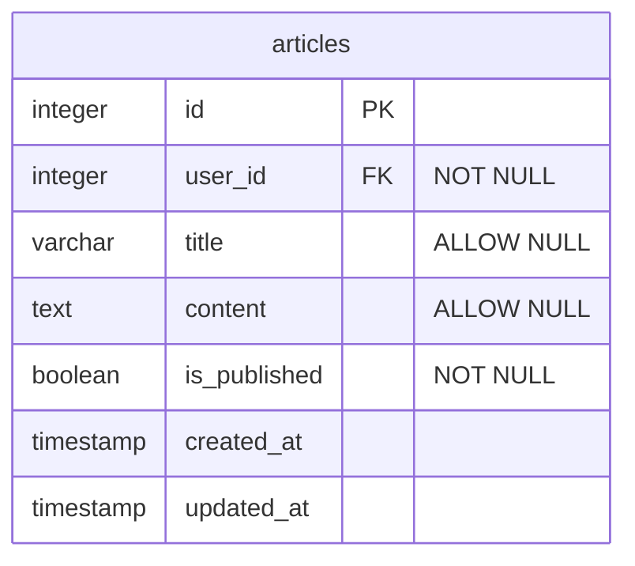
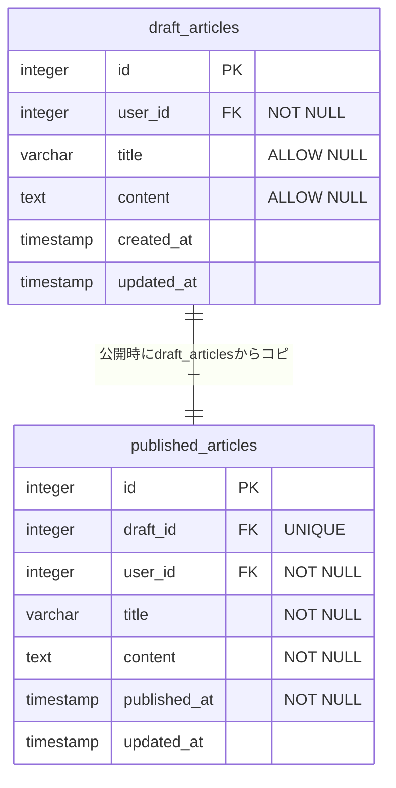
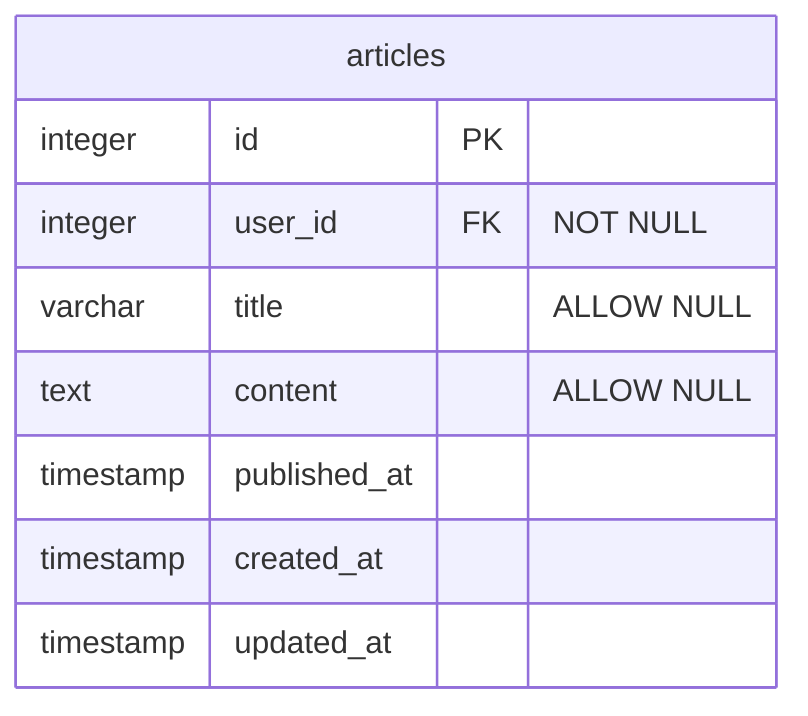
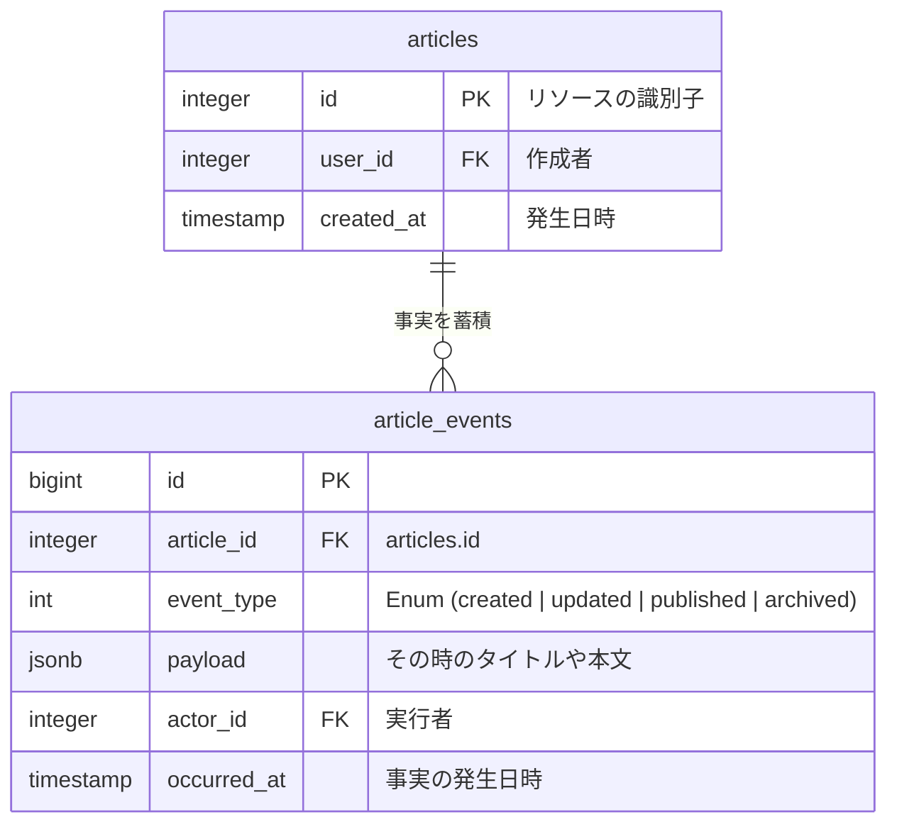
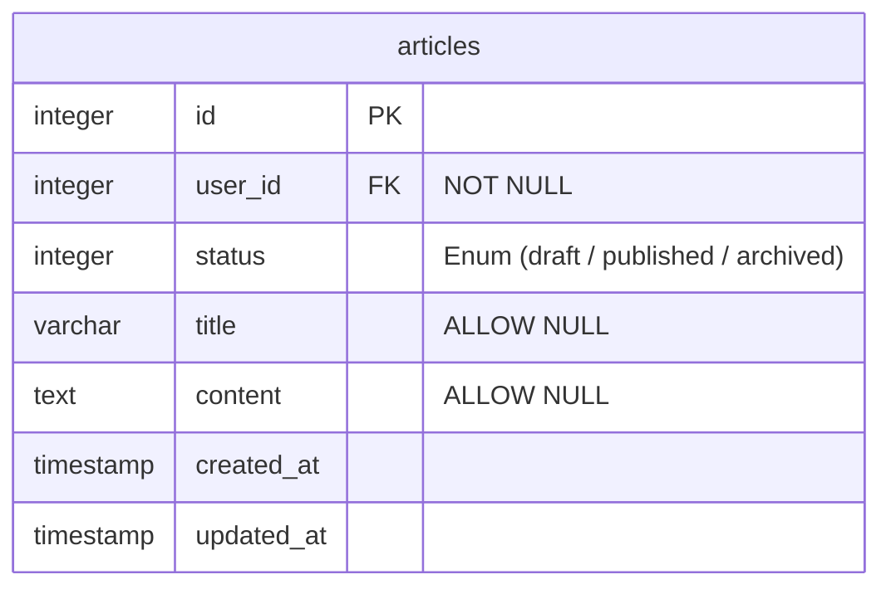

## はじめに

テーブル設計において、「とりあえずフラグ追加」は、データ整合性の低下、検索パフォーマンスの劣化、および情報の損失を招く恐れがあります。

この記事では、フラグを追加する際、あるいは設計レビューをする際に、負債を抱えないために立ち止まって検討すべきポイントをまとめました。

### 題材
以下のような記事テーブルを題材として考えます。
一つのテーブルで「下書き」と「公開」を管理しているケースを例に考えます。

この設計には、一見シンプルですが運用上いくつかの懸念が隠れています。

* 制約の矛盾： 「公開時はタイトル必須」というルールをDBレベルで強制できない（下書きのためにNULLを許容せざるを得ない）。
* 検索効率： 記事数が増えた際、低カーディナリティな is_published フラグではインデックスが効きにくい。
* 事実の欠落： 「いつ公開されたか」という証跡を単独では持てない。

これらの課題を、以下の3つの観点から解決策を考えます。

## 🤔構造の分離：別テーブルにできないか

まずは**状態によって守るべきルール（制約）が異なるか**という点を確認しました。

フラグで状態を管理しようとすると、すべての状態に対して「最もゆるい制約」を適用せざるを得ません。
これはアプリケーション層でのバリデーションが複雑になり、DBレベルでの品質担保は難しくなります。

### 💡制約レベルの分離

題材に挙げた「記事」の管理では、下書きと公開済みでバリデーションルールが根本的に異なります。

* **下書き：** 執筆途中のため、タイトルや本文が未入力（NULL）でも保存を許容したい。
* **公開時：** 読者に提供するため、タイトルや本文は必須（NOT NULL）でなければならない。

これらを同一テーブルに同居させると、公開記事に対してもカラム定義を `ALLOW NULL` にせざるを得ません。その結果、プログラムのバグで「タイトルが空の公開記事」が作られるリスクをDB側で防げなくなります。

### 💊解決策：テーブルを物理的に分ける

以下のようにテーブルを分離することで、公開記事に対してのみ厳格な `NOT NULL` 制約を課すことが可能になります。

**この設計によるメリット：**

* **データ品質：** DBが「正しい公開データ」のみを保持することを保証してくれる。
* **パフォーマンス：** 公開記事の検索時に、膨大な下書きデータを除外してスキャンできるため、パフォーマンスが向上する。

## 🤔時間軸の導入：日付・履歴にできないか

単なるフラグを、**「いつその出来事が起きたか」という日時の保持**に置き換えるアプローチです。

題材の `is_published`（boolean）を `published_at`（timestamp）に置き換えることで、情報の解像度が格段に上がります。

### 💡日付（xxx_at）で持つメリット

* **証跡が残る：** 「公開されているか」だけでなく「いつ公開されたか」がわかるようになります。
* **判定とソートの両立：** `WHERE published_at IS NOT NULL` でフラグと同等の判定ができ、かつそのまま公開順のソートにも利用できます。
* **パフォーマンス：** 0/1のフラグに比べて日時値はカーディナリティ（値の分散度）が高いため、特定の期間で絞り込む際にインデックスが効きやすくなります。

### 💊解決策：事実（Fact）を記録する

パターンAとして単純なフラグを日時に置き換えました。
さらに発展させたパターンBとして、詳細なプロセスが必要なケースに備え、履歴テーブルへ切り出しました。

#### パターンA：日時カラムへの置換

`is_published` を `published_at` に変更し、「フラグ」から「事実」の記録へと昇華させます。

#### パターンB：履歴テーブルへの切り出し

「いつ」だけでなく、「誰が」「なぜ」その状態にしたかというプロセス自体にビジネス価値がある場合は、UPDATEではなくINSERTによる**イミュータブルな事実の記録**を検討します。

:::message
payload にはその瞬間のデータのスナップショット（タイトル、本文等）を丸ごと保存します。これにより、後から特定の時点の状態を復元できるようになります。
:::

**この設計によるメリット：**

* **不変性の確保：** 過去の事実は書き換えられることなく、証跡として積み上がります。
* **監査・分析：** 「誰が承認したか」「公開までに何回の修正が必要だったか」といった分析が可能になります。
* **運用耐性：** 万が一の誤操作時も、履歴を辿ることで過去の状態を正確に復元できます。

## 🤔状態の集約：Enumにできないか

題材の設計に、後から「アーカイブ（`is_archived`）」や「削除済み（`is_deleted`）」といったフラグを追加したくなった場合、複数の `boolean` カラムが並ぶことになります。
そのケースに対応するため、複数のフラグを並立させるのではなく、**一つの「状態（status）」カラムとして定義**することを検討します。

### 💡「フラグの乱立」による矛盾の発生

複数のフラグで管理しようとすると、論理的にあり得ない状態が生まれてしまう可能性があります。

* **不整合なデータ：** `is_published: true` かつ `is_archived: true`（公開中なのにアーカイブされている）。
* **複雑なクエリ：** 「公開中の記事だけを取得」するために、`WHERE is_published = true AND is_archived = false AND is_deleted = false` といった、除外条件の多い複雑なSQLが必要になります。

### 💊解決策：状態（status）への集約

これらを `article_status` という一つの列にまとめ、Enum型で管理します。

**この設計によるメリット：**

* **不整合の排除：** 記事は必ず「どれか一つの状態」にしか成れないため、矛盾したデータが物理的に発生しません。
* **可読性の向上：** クエリが `WHERE status = 'published'` とシンプルになり、コードを読んだだけで意図が伝わります。
* **拡張性：** 新しい状態（例：`reviewing` 審査中）が増えた際も、カラムを追加せず値の定義を増やすだけで対応できます。

:::message alert
#### パフォーマンスの注意点：インデックスとカーディナリティ
フラグだけでなくEnumも含め「値の種類が少ない（カーディナリティが低い）」カラムにインデックスを貼る際は注意が必要です。例えば、全レコードの8割が `published` の場合、そのインデックスはほぼ機能せずフルスキャンになります。
その場合、「状態」と「カーディナリティの高いカラム」を組み合わせた複合インデックスの活用を張ることで効率的にデータを絞り込めるようにしましょう。
:::

### 結論
「とりあえずフラグ追加」という選択は、将来のデータ不整合、パフォーマンスの劣化、そして重要な履歴の喪失につながると考えています。

そのため設計時には、以下の3つのポイントを意識しています。

* 構造の分離（別テーブル）： 制約（ルール）が違うなら、物理的に分ける。
* 時間軸の導入（日付・履歴）： 出来事の証跡が必要なら、事実を記録する。
* 状態の集約（Enum）： 排他的な状態なら、一つにまとめる。

これらを検討することで、数年後の自分やチームメンバーが「メンテナンスしやすい」と感じる、運用耐性の高いテーブル構造に繋がればと思います！