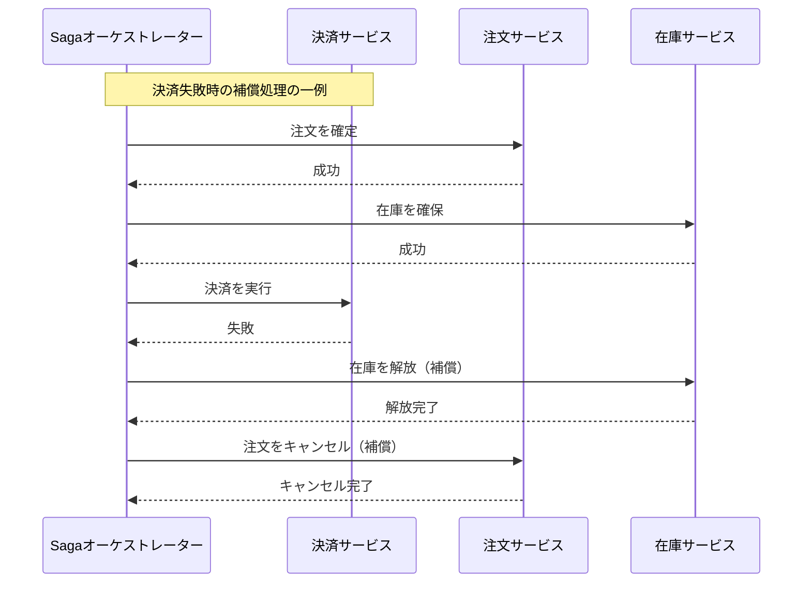

[OutboxパターンをRubyで理解する](https://zenn.dev/sloppybook/articles/41aacbae3617af) という記事で、DBへの保存とイベント発行を分ける方法を学びました。そこからさらに、複数サービスにまたがる処理全体と、途中で失敗した場合の補償処理を扱う Saga パターンについて、Rubyで手を動かして学びます。

マイクロサービスでは、注文、在庫、決済のような処理が複数のサービスにまたがることがあります。それぞれのサービスが別のDBを持っている場合、すべての処理を1つのDBトランザクションでまとめることはできません。

このような処理を、各サービスのローカルトランザクションと補償処理の組み合わせで管理するパターンが **Saga** です。

## 具体例: 注文、在庫、決済

次の処理を考えます。

```text
注文を確定する
  ↓
在庫を確保する
  ↓
決済する
```

決済に失敗した場合、すでに確保した在庫を解放し、注文をキャンセルする必要があります。この取り消し処理を **補償処理** と呼びます。



## Sagaの2つの方式

Saga には大きく2つの方式があります。

| 方式          | 特徴                                                 |
| ------------- | ---------------------------------------------------- |
| Choreography  | 各サービスがイベントを発行し、次のサービスが処理する |
| Orchestration | オーケストレーターが処理順序と補償処理を管理する     |

この記事では、処理の流れを追いやすい Orchestration 方式を実装します。

## Rubyによる実装

各サービスは、自分の処理だけを担当します。複数サービスの順序と失敗時の補償は `SagaOrchestrator` が管理します。

以下は、サービス間通信やDBトランザクションを省略した学習用の同期シミュレーションです。実際のシステムでは、各サービスの状態を永続化し、タイムアウト、再送、補償処理の失敗も設計します。

```ruby
class OrderService
  def initialize
    @db = []
  end

  attr_reader :db

  def confirm(order_id)
    raise "注文の確定に失敗しました" if rand < 0.3

    @db << { order_id: order_id, status: :confirmed }
    puts "[Order] 注文を確定しました: #{order_id}"
    true
  end

  def cancel(order_id)
    @db << { order_id: order_id, status: :cancelled }
    puts "[Order] 注文をキャンセルしました: #{order_id}"
  end
end

class InventoryService
  def initialize
    @db = []
  end

  attr_reader :db

  def reserve(order_id)
    raise "在庫の確保に失敗しました" if rand < 0.3

    @db << { order_id: order_id, status: :reserved }
    puts "[Inventory] 在庫を確保しました: #{order_id}"
    true
  end

  def release(order_id)
    @db << { order_id: order_id, status: :released }
    puts "[Inventory] 在庫を解放しました: #{order_id}"
  end
end

class PaymentService
  def initialize
    @db = []
  end

  attr_reader :db

  def charge(order_id)
    raise "決済に失敗しました" if rand < 0.3

    @db << { order_id: order_id, status: :charged }
    puts "[Payment] 決済に成功しました: #{order_id}"
    true
  end
end

class SagaOrchestrator
  def initialize(order_service, inventory_service, payment_service)
    @order_service = order_service
    @inventory_service = inventory_service
    @payment_service = payment_service
  end

  def execute(order_id)
    completed_steps = []

    raise "注文の確定に失敗しました" unless @order_service.confirm(order_id)
    completed_steps << :order

    raise "在庫の確保に失敗しました" unless @inventory_service.reserve(order_id)
    completed_steps << :inventory

    raise "決済に失敗しました" unless @payment_service.charge(order_id)

    puts "[Saga] 処理が完了しました: #{order_id}"
  rescue => error
    puts "[Saga] 処理に失敗しました: #{error.message}"
    compensate(order_id, completed_steps)
  end

  private

  def compensate(order_id, completed_steps)
    if completed_steps.include?(:inventory)
      begin
        @inventory_service.release(order_id)
      rescue => error
        puts "[Saga] 在庫解放に失敗しました: #{error.message}"
      end
    end

    if completed_steps.include?(:order)
      begin
        @order_service.cancel(order_id)
      rescue => error
        puts "[Saga] 注文キャンセルに失敗しました: #{error.message}"
      end
    end

    puts "[Saga] 補償処理が完了しました: #{order_id}"
  end
end
```

## 実行例

実行すると、各サービスが30%の確率で失敗し、失敗したステップより前に完了した処理だけが補償される様子を確認できます。

```ruby
order_service = OrderService.new
inventory_service = InventoryService.new
payment_service = PaymentService.new

saga = SagaOrchestrator.new(order_service, inventory_service, payment_service)
saga.execute("order-001")
saga.execute("order-002")
saga.execute("order-003")
saga.execute("order-004")
saga.execute("order-005")
puts "[DB] Order: #{order_service.db.inspect}"
puts "[DB] Inventory: #{inventory_service.db.inspect}"
puts "[DB] Payment: #{payment_service.db.inspect}"
```

実行結果はランダムに変わります。例えば、決済失敗時には次のように、各サービスのDBに成功処理と補償処理が記録されます。

```text
[Order] 注文を確定しました: order-001
[Inventory] 在庫を確保しました: order-001
[Saga] 処理に失敗しました: 決済に失敗しました
[Inventory] 在庫を解放しました: order-001
[Order] 注文をキャンセルしました: order-001
[Saga] 補償処理が完了しました: order-001
[Order] 注文を確定しました: order-002
[Inventory] 在庫を確保しました: order-002
[Payment] 決済に成功しました: order-002
[Saga] 処理が完了しました: order-002
[Order] 注文を確定しました: order-003
[Inventory] 在庫を確保しました: order-003
[Payment] 決済に成功しました: order-003
[Saga] 処理が完了しました: order-003
[Order] 注文を確定しました: order-004
[Inventory] 在庫を確保しました: order-004
[Payment] 決済に成功しました: order-004
[Saga] 処理が完了しました: order-004
[Order] 注文を確定しました: order-005
[Inventory] 在庫を確保しました: order-005
[Payment] 決済に成功しました: order-005
[Saga] 処理が完了しました: order-005
[DB] Order: [{order_id: "order-001", status: :confirmed}, {order_id: "order-001", status: :cancelled}, {order_id: "order-002", status: :confirmed}, {order_id: "order-003", status: :confirmed}, {order_id: "order-004", status: :confirmed}, {order_id: "order-005", status: :confirmed}]
[DB] Inventory: [{order_id: "order-001", status: :reserved}, {order_id: "order-001", status: :released}, {order_id: "order-002", status: :reserved}, {order_id: "order-003", status: :reserved}, {order_id: "order-004", status: :reserved}, {order_id: "order-005", status: :reserved}]
[DB] Payment: [{order_id: "order-002", status: :charged}, {order_id: "order-003", status: :charged}, {order_id: "order-004", status: :charged}, {order_id: "order-005", status: :charged}]
```

例えば決済に失敗した `order-001` は、注文DBに `:confirmed` と `:cancelled`、在庫DBに `:reserved` と `:released` が残り、決済DBには成功記録が残りません。


## Outboxとの関係

Saga は複数サービスにまたがる処理の順序と補償処理を管理します。一方、Outbox はサービスが次のイベントを失いにくく発行し、失敗時に再試行するためのパターンです。

Saga の各ステップでイベントを使う場合、イベント発行部分に Outbox を組み合わせることがあります。つまり、Saga と Outbox は競合するパターンではなく、異なる問題を解決するために併用できます。

## 学べたこと

Saga は、複数のサービスにまたがる処理を各サービスの処理と補償処理を組み合わせて整合性を保ちます。

特に重要なのは、補償処理は通常のロールバックとは違うことです。決済や外部APIの呼び出しを完全に巻き戻せるとは限らないため、キャンセル、返金、在庫解放など、業務上の取り消し処理をあらかじめ設計する必要があります。
