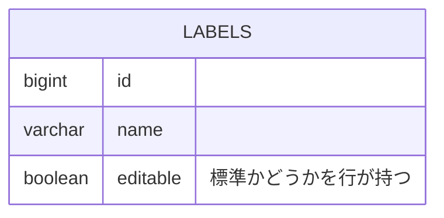
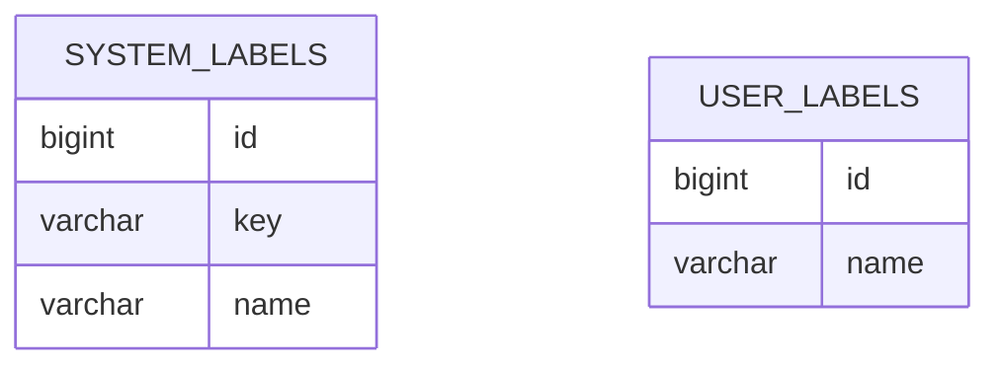

コードレビューで「こっちの方がシンプルではないか」と案を提案したところ、「今のままのほうがシンプルではないか」と返ってきた経験はないでしょうか。どちらも嘘をついていません。ただ、別のものを指しています。

やっかいなのは、差分に現れるのは往々にしてEasyであり、Simpleではないことです。そのため、レビューで「シンプル」と言うとき、SimpleとEasyが混ざります。この記事では、なぜこの混同が起きるのかを、Easyの実装上のしやすさとSimpleの構造上の単純さが、それぞれどこに現れるのかという観点から考えます。

この記事では判断をどこに置くかを見るという視点によって、設計を考えるときの小さなヒントになれば幸いです。今回の例は、私が実際に経験した設計上の議論をもとに、題材や細部を置き換えて書いています。


:::message
今回は主に設計や実装をレビューする側の視点で書きました。期日を背負って実装している側から見れば、同じトレードオフでも重みは違うはずで、そこは差し引いて読んでください。


:::

Rich Hickeyの[講演「Simple Made Easy」](https://www.infoq.com/presentations/Simple-Made-Easy/)を参考にさせていただきました。ただし主題は講演の解説ではなく、**この区別が実際の設計判断のどこで効いてくるか**です。コードはRuby（一部はSQL）で書きますが、話しているのは判断の置き場所なので、言語は問いません。

講演の内容をわかりやすく知りたい人には、[なぜ「簡単」なコードが複雑になるのか](https://zenn.dev/loglass/articles/6b56dac587f02e)も参考になります。

## Simple は構造の話、Easy は距離の話

この区別の出典はRich Hickeyの講演「Simple Made Easy」(2011) です。まずはそこでの定義を確認しておきます。

- **Simple**: 構造的に絡んでいない状態。ひとつのものが、ほかのものと編み合わされていない。
- **Easy**: 人にとって実装しやすいこと。慣れていて、すぐ理解できて、すぐ使える。

Hickeyは複雑さの正体を **complect（絡み合わせる）** という古語で呼び、「Simpleは客観的で、Easyは相対的だ」と述べています。つまり **Simpleは構造の状態、Easyは人間の経験**です。前者は人間がいなくても成り立ちますが、後者は「誰にとって」を指定しないと意味をなしません。

ここでいう「実装しやすさ」は、変更量や手数の少なさとして表れます。しかも厄介なことに、**Easyな選択ほど「シンプルな差分」に見えます**。行数が少なく、影響範囲が狭く、テストも通ります。

ここからは、SimpleとEasyを設計レビューで考えやすくするために、次のように言い換えます。

- **Simple**: 1つの関心を、できるだけ限られた場所で扱えている
- **Easy**: いま書く人にとって慣れていて、すぐに実装できる

「絡み合っていない」かどうかをその場で判定しようとすると手が止まりますが、「この関心はどこに置かれているか」なら、コードを指さしながら話せます。

**この記事の要点**

- 差分の小ささと、構造の単純さは別です。
- 設計を比べるときは、判断をどこに置くかを見ます。
- 判断の置き場所によって、考慮する範囲も変わります。

以下、4つの具体例で、その境界線がどこにあるかを見ていきます。

## 例1: そのフラグを覚えておく範囲はどこまでか

記事一覧に、`current_user`が各記事に「いいね」しているかを表示したいとします。判定元は別テーブル（`likes`）にあります。行ごとに判定するとN+1になるため、いいね済みのIDをまとめて取得し、各行に持たせます。

```ruby
# ActiveModelSerializers
class PostSerializer < ActiveModel::Serializer
  attributes :liked

  def liked
    object.liked_by?(scope) # scopeにはcurrent_userが入る。行ごとにSELECT。
  end
end

render json: posts, each_serializer: PostSerializer, scope: current_user
```

以下の取得処理は、このあと見る3つの案に共通です。

```ruby
require "set"

class Like < ApplicationRecord
  # このユーザーがいいね済みの post_id を、1クエリでまとめて引く
  def self.liked_post_ids(posts, user)
    where(post_id: posts.map(&:id), user_id: user.id)
      .pluck(:post_id)
      .to_set
  end
end
```

問題は、ここで得た集合を**どうやって各行に届けるか**です。

以下のいただいた案では、**モデルにキャッシュ用のアクセサを生やして、一覧を取ってくる場所で値を設定する**形です。既存の呼び出し側を変えずに済むので、実装者にとってはEasyです。

```ruby
class Post < ApplicationRecord
  # 事前に設定しておくための置き場
  attr_accessor :liked_override

  def liked_by?(user)
    return liked_override unless liked_override.nil?

    likes.exists?(user_id: user.id)
  end
end

# 一覧を取ってくる場所で、各レコードに一時状態を設定する
def stamp_liked_flags(posts, user)
  ids = Like.liked_post_ids(posts, user)
  posts.each { |post| post.liked_override = ids.include?(post.id) }
end
```
※ この簡略例では、同じ`Post`を別ユーザーの判定には使わない前提です。

避けたい理由はフラグそのものではなく、**そのフラグを覚えておかなければならない範囲**にあります。

まず、`Post` に**永続化されない一時的な状態**が1つ増えます。`attr_accessor` はカラムと同じ顔で並ぶのに、中身は「直前の処理が埋めた可能性のある値」で、`reload` しても消えません。そして `liked_by?` の意味が2つになります。値が設定されていればその値、そうでなければクエリです。つまり、同じメソッドが、値を設定したかどうかで別の振る舞いをします。

**可変な属性を1つ足すと、モデルの振る舞いが状態によって変わる可能性が増えます。**

属性が増えるほど、モデルの振る舞いの組み合わせも増えます。もちろん実際に全通りを検討するわけではありません。ただ、検討しなくてよいと確信するために、その属性が今書いている処理に絡むかどうかを読む必要があります。しかもモデルはコントローラと違って多くの場所から呼ばれるので、その組み合わせは、その処理と無関係なコードを書くときにも意識することになります。手数は少ないですが、支払いは「このモデルを触る人の思考コスト」という形で、差分の外に広がります。

もしレスポンスのハッシュを自分で組めるなら、以下が素直です。
2行増えるだけで、新しいクラスや属性は増えません。持ち回す状態もどこにも増えず、`liked_ids` を覚えておく必要があるのは、このブロックの中だけです。
ただ、今回のケースでは共通のシリアライザを通るため、この方法をそのまま適用できませんでした。

```ruby
liked_ids = Like.liked_post_ids(posts, current_user)

posts.map do |post|
  { id: post.id, liked: liked_ids.include?(post.id) }
end
```

こちらからは別の案として、判定結果を**表示用のラッパー**に持たせる形を考えました。モデルは一行も変えません。使っている `SimpleDelegator` は、ラッパー自身に実装されていないメソッドを包んだオブジェクトにそのまま渡してくれる、Ruby標準のラッパー用クラスです。

```ruby
require "delegate"

class PostWithLikedFlag < SimpleDelegator
  def initialize(post, user, liked)
    super(post)
    @user_id = user.id
    @liked = liked
  end

  def liked_by?(user)
    return @liked if user.id == @user_id

    __getobj__.liked_by?(user)
  end
end
```

これで効くのは、**このon/offを考える必要があるのは、ラッパーを持っている間だけ**になることです。対象ユーザー以外では元の `Post` に委譲するため、別のユーザー向けの処理へ漏れても、いいね状態を取り違えません。`Post` を直接使っている場所では、考えることは何も増えていません。そしてラッパーで包むのを忘れても、元の `liked_by?` がそのまま動きます。N+1に戻るだけで、**返る値は変わりません**。失敗の仕方が安全側に倒れています。

呼び出し側から見れば、何も変わりません。

```ruby
# 一覧を取ってくる場所で、コレクションをこっそり差し替える
def timeline_posts(user)
  posts = Post.published.order(created_at: :desc).to_a
  liked_ids = Like.liked_post_ids(posts, user)
  posts.map { |post| PostWithLikedFlag.new(post, user, liked_ids.include?(post.id)) }
end

# シリアライザ側は1行も変えなくていい
render json: posts, each_serializer: PostSerializer, scope: current_user
```

ポイントは、**一覧を取得する場所の中**で差し替えることです。呼び出し側から見ると `Post` の配列を受け取ったように見えますが、実際には `Post` そのものではありません。`is_a?`、`to_model`、シリアライザ、関連操作、キャッシュキーなどが `Post` と同じように動くとは限らないため、このラッパーは一覧表示のシリアライズ経路に閉じ込めます。

つまりラッパー案は、**状態を考える範囲をモデル全体から一時オブジェクトの寿命の中へ縮める**代わりに、「レコードのように振る舞うがレコードではないもの」という概念を1つ増やしています。どちらを選んでも、コストは発生します。それでもこちらを選ぶのは、ラッパーならクラス名や生成箇所を見れば存在に気づける一方、モデルの可変属性は、どこで設定されたかを呼び出し側のコードから追わないと気づきにくいからです。

「ラッパーは大げさ」という見方もあります。ただ、増えるのはクラス1つで、その存在を意識する必要があるのは一覧を組み立てる間だけです。

以下がトレードオフです。

| 判定結果の置き場所 | 差分 | **それを考えないといけない範囲** |
| ------------------ | ---- | -------------------------------- |
| モデルの可変属性   | 最小 | `Post` を使う全コード            |
| 表示用ラッパー     | 中   | ラッパーを持っている間だけ       |

:::message
**見分け方**: 状態を1つ追加するときは、値が正しいかだけでなく、**その状態を覚えておかないといけない範囲**を見ます。そして多くの場合、**いちばん小さい差分が、いちばん広い範囲を要求します。**

:::

この例のように、一見Simpleに見える選択が、実はEasyなだけで、システム全体では複雑さを増やしていることがあります。

## 例2: フラグは区別を表現できるが、強制できない

Gmailのラベルを思い浮かべてください。はじめは「受信トレイ」「送信済み」のように、システムが用意したラベルだけがありました。そこに、**ユーザーも自分でラベルを作って付けられるようにしたい**という要望が来ます。並べて表示しますが、標準のラベルは名前を変えたり削除したりできません。

いただいた案は、既存の `labels` テーブルに `editable` フラグを1本足す形でした。テーブルを増やさずに済みます。一覧はUNIONなしで引けますし、既存のAPIもそのまま動きます。

一見するとSimpleに見えます。しかし、ここで見えているのはテーブルを増やさずに済むという実装のしやすさです。

今回のようにフラグで持つと、**行ごとに「この行は編集できるか」が変わります**。更新・削除・バリデーション・権限チェックのすべてに「標準のものなら弾く」分岐が必要になります。しかもその分岐は、**付け忘れてもテストは通るし画面も動きます**。ルールを守るために、利用する側の注意が毎回必要になります。
フラグ設計の一般論は、[過去記事](https://zenn.dev/moneyforward/articles/57f2197681b2e2)にまとめています。ここでは、**フラグはルールを表現できても、強制しにくい**点に絞ります。

:::details Schema and SQL examples.



```sql
-- 編集に関わるあらゆる場所でこの絞り込みが必要になる
UPDATE labels SET name = 'あとで読む' WHERE id = 42 AND editable = true;
-- ← AND 以降を書き忘れてもエラーにならず、標準ラベルを書き換えてしまう可能性がある
```

一方、ユーザーのラベルを別のテーブルとして追加すると、不変条件をスキーマ側に置きやすくなります。
以下では、所有者やラベル付与の関係は省略します。



```sql
-- 編集系は user_labels しか触らない
UPDATE user_labels SET name = 'あとで読む' WHERE id = 42;
-- ← 絞り込みを書かなくても、標準ラベルに誤って触れることはない
```

:::

編集系のコードはユーザー定義側のテーブルしか触らないので、「標準のものは変更できない」がコード上の注意ではなくスキーマの性質に近づきます。もちろん `system_labels` を直接更新するコードは書こうと思えば書けます。なくなるのは、うっかり触ってしまう経路のほうです。さらに本当に変更を禁止するなら、アプリケーションの権限やDBのロール、更新トリガなどで `system_labels` への書き込み自体を制限します。

Railsを使用していれば、ActiveYamlで管理する方法も選択肢になります。
このように**条件分岐で守っていたルールを、置き場所と権限で守る**ことを考えます。

もちろんこちらにもコストがあります。一覧ではUNIONが必要になります。また、ID空間が分かれるため、外に見せるIDの形式を決めなければいけません（UUIDを追加するのか、prefixを付けるのか、`{ id, type }` の形にするのか）。すでにAPIを公開していれば、破壊的変更にもなりえます。**分離のコストは内部に収まらず、インタフェースにまで漏れ出ます。**

それでもこのケースでは分けることにしました。標準ラベルが書き換わってしまうのは後から気づけない壊れ方で、IDの設計は公開前に一度払えば済むコストだったからです。

:::message
**見分け方**: フラグは区別を*表現*するには十分です。カラムを見ればどちらか分かりますし、ドキュメントとしても読めます。不足しているのは**強制**です。「フラグで分かるのでよいのでは」と思ったときは、そのルールを壊せるコードが書けてしまうかどうかを見ます。

:::

## 例3: UIを楽にするために、履歴を捨てていないか

配送の追跡画面を作っているとします。利用者向けの画面では「現在地」「現在のステータス」「到着予定」だけを表示します。配送業者からの通知が時間差で届き、ステータス・現在地・到着予定が少しずつ更新されていくため、これをどう保存するかで議論になりました。

最初にいただいたのはUPDATE案でした。配送状態のレコードは1件だけ持ち、通知が来るたび上書きします。レコードは増えないので、フロントは1件読めば済みます。

コードにすると差はこれだけです。

```ruby
# UPDATE 案: 配送状態を has_one で1件だけ持ち、上書きし続ける
shipment.state.update!(status: :out_for_delivery, location: "東京中継所")
```

配送状況を表示するだけなら、フロントに通知履歴を渡して、項目ごとにどの値を採用するか判断させる必要はありません。UPDATE案なら、バックエンドが最新状態を1件にまとめ、フロントはそのスナップショットを読むだけです。なので**表示状態は単一のスナップショットで扱うのが自然です**。

しかし、問い合わせ対応では「いつ発送されたか」「いつ輸送中になったか」といった通知履歴を時系列で確認したいことがあります。**現在の表示状態だけでなく、いつ何が起きたかも必要です。**


そこで、選んだのがINSERT案です。直前の状態をコピーしてINSERTすれば、最新レコードが全項目の現在値を持ちます。フロントは最新の1件だけ読めるので、UIの単純さと履歴の保存を両立しやすくなります。ここで分けているのは、「今この画面に何を出すか」と「いつ何が起きたか」という2つの関心です。

```rb
previous_state = shipment.states.order(:occurred_at, :sequence).last
attributes = previous_state&.slice(:status, :location, :eta) || {}
shipment.states.create!(
  attributes.merge(
    status: notification.status,
    location: notification.location,
    occurred_at: notification.occurred_at,
    sequence: notification.sequence,
  )
)
```

- **UPDATE案**: 配送状態のレコードは1件だけ持ち、通知が来るたび上書きします。レコードは増えません。フロントは1件読めばよいです。
- **INSERT案**: 直前の状態をコピーし、変わった値を反映した新しいレコードを作ります。一覧は配送履歴になります。

ここで扱っている「状態をUPDATEせず、履歴として追記する」という考え方は、[イミュータブルデータモデル](https://scrapbox.io/kawasima/%E3%82%A4%E3%83%9F%E3%83%A5%E3%83%BC%E3%82%BF%E3%83%96%E3%83%AB%E3%83%87%E3%83%BC%E3%82%BF%E3%83%A2%E3%83%87%E3%83%AB)と重なります。詳しい内容はこちらの記事をご覧ください。。

なお、この例のINSERT案はイベントモデルそのものではなく、現在値を含むスナップショットを積む設計です。イベントモデルを採る場合は、投影や順序管理を別途設計します。

INSERT案にもコストがあります。以下のコードは、通知がイベント順に届く場合の簡略例です。通知が前後して届く場合、現在の `previous_state` をコピーして追加するだけでは、その通知時点のスナップショットを再現できません。履歴の再構築や投影の更新が必要になります。行は通知のたびに増えるので、最新の1件を引くインデックスも要りますし、同じ配送に対して通知が前後して届いたときの順序も決めなければいけません。実運用では `created_at` だけを順序の根拠にせず、業者側のイベント時刻やシーケンス番号を保存します。通知IDにはユニーク制約を置き、同時更新にはトランザクションや楽観ロックを使う必要があります。

それでもこちらを採ったのは、このケースに**非対称性**があったからです。履歴が後から必要になったとき、すでに上書きしたデータは戻りません。逆に不要だと分かったら、その時点でコードを変えて余分な行を消せます。**判断が非対称なら、戻せる側に倒します。**

履歴が不要ならUPDATE案も選べます。ただ、後から必要になる可能性があるなら、履歴を捨てず、現在状態の読み取りやすさとは別に管理できるINSERT案へ寄せます。画面は今までどおり最新の1件だけを読めます。

:::message
**見分け方**:「レコードを増やさない」「フロントを楽にする」は、Easyを判断するときに出てきやすい観点です。Simpleかどうかを見るには、スナップショットと履歴という別の関心を、同じ1行のUPDATEに押し込めていないかを確認します。

:::

## 例4: 位置の出どころを、埋めた場所で記録するか、あとで推測するか

写真アプリで、撮影地を地図に出していました。位置はいくつかの手段で埋まります。EXIFにGPSがあればそれを使い、なければ前後の写真から推測し、それでもだめなら写っているランドマークを画像認識で当てます。そこに、地図上で**「正確な位置」と「おおよその位置」を出し分けたい**という要望が来ます。前提として、位置を埋める経路は取り込み直後と、あとからのバッチの2つに分かれていました。

いただいた案は、**保存されたレコードを起点に、あとから出どころを判定する**形でした。「EXIFが空なのに座標が入っているなら推測由来だろう」という要領で、埋める処理には一行も触れません。

```ruby
# 保存済みのレコードを起点に「どの手段で埋まったか」を推測する
def location_source(photo)
  return :exif         if photo.exif_gps
  return :nearby_photos if NearbyPhotos.estimate(photo)
  return :landmark     if LandmarkRecognition.detect(photo)

  nil
end
```

Simpleに見えますが、ここで見えているのは保存済みの写真を起点に、あとから判定すればよいという実装のしやすさです。保存済みの写真を境界にでき、ユニットテストも書きやすいので、実装する人にとってはEasyです。

問題は、この条件が**埋める側の条件のコピー**だということです。「どの手段を優先するか」というルールが、**埋める場所と、出どころを推測する場所の二か所に書かれます**。片方だけを変えても、テストは通ります。

さらに、この形は手段が増えたときに付いていけません。Wi-Fi測位を追加すると、保存された座標からは近接推測とWi-Fiを区別できません。その位置は「おおよその位置」とだけ表示し、どの手段で埋まったのかは諦めることになります。

一方、**位置を埋めた場所で、出どころも一緒に書く**形はこうなります。

```ruby
# 位置を決める場所が、座標と出どころを同時に決める
if (gps = photo.exif_gps)
  photo.set_location(gps, source: :exif)
elsif (nearby = NearbyPhotos.estimate(photo))
  photo.set_location(nearby, source: :nearby_photos)
elsif (landmark = LandmarkRecognition.detect(photo))
  photo.set_location(landmark.coordinates, source: :landmark)
end
```

差分は大きく、位置と出どころを同時に扱うため、記述も冗長になります。分かれている2つの経路を揃えるリファクタも先に必要です。その代わり、条件の重複を避けられます。手段が増えても、増えた場所が自分の出どころを書きます。

こちらにもコストがあります。既存の写真は出どころを持たないままなので、遡って埋めるのか、「不明」を表示するのかを決める必要があります。

それでも、出どころを後から推測するより、位置を決めた処理に記録させるほうが条件の重複を避けやすいと判断しました。

:::message
**見分け方**:「あとで判定できる」は、たいてい「同じ条件をもう一度書ける」という意味です。値と、その値の出どころは同じ場所で決まります。離して置くなら、離した分を同期し続ける仕事が残ります。

:::

## 4例に共通しているのは「判断を誰に委ねるか」

並べてみると、4つとも同じ形をしています。Easy案は**判断を使う側に委ねます**。この記事でいうSimple案は、**判断をより限られた範囲に集めます**。

|               | Easy案: 判断を利用側に委ねる | Simple案: 判断を限られた場所に集める |
| ------------- | ---------------------------- | ------------------------------------ |
| 例1: いいね   | モデルに可変フラグ           | 表示用ラッパーに持たせる             |
| 例2: ラベル   | editableフラグ               | テーブルを分ける                     |
| 例3: 配送     | 1行を上書き                  | スナップショットを積む               |
| 例4: 位置情報 | あとで条件を再判定           | 位置を決める場所で記録する           |

例1ではラッパー案を採りました。完全にSimpleな側を採れるとは限らないということで、実際にやっているのは、**その場で払える差分の範囲で、判断を覚えておく範囲をできるだけ狭くする**という寄せ方です。

そして判断を利用側に委ねると、そのこと自体がコード上で見えにくくなります。フラグの設定や絞り込み、履歴の扱いを個別に判断する必要があり、**Easyのコストは差分の外に時間差で現れます**。変更が重なるほど、その負担も積み上がります。

だから最後に確認するのは、この3つです。

1. **その「楽」は誰の楽か**
    
    今書く人、半年後に読む人、APIの利用者。主語を変えても同じ結論になるなら、それはたぶんSimpleです。
    
2. **間違えたとき、どちらが戻せるか**
    
    消したデータは戻りません。余分な行は消せます。公開したインタフェースは戻せません。
    
3. **Easyを選ぶなら、寿命の短いところで選ぶ**
    
    一度きりの移行スクリプトや、数ヶ月で捨てる検証用の画面なら、自分もEasyを通します。逆にドメインの中心や、一度公開したら戻せないものは、時間をかけてもSimpleに倒します。自分が気にしているのは選ぶことそのものでなく、EasyをSimpleだと思い込むことで、トレードオフが記録されないままになることです。
    

## まとめ: 差分の小ささは Simple の根拠にならない

SimpleとEasyが混ざるのは、Easyの実装上のしやすさは差分に現れるのに、Simpleの構造上の単純さは差分に現れにくいからです。さらに、Easyは誰にとってのEasyかで意味が変わります。

「シンプル」が通じないのは、この言葉が構造の話と体験の話を兼ねているからです。

どのケースでも、Easyな側は差分が小さかったです。そしてその小ささは、本来自分たちで抜いておくべき絡み合いを、後から読む人に渡した結果であったことがありました。**差分が小さいことは、Simpleであることの根拠にはなりません。**

ただ考慮された上でEasyを選ぶのは、何も悪いことではないと考えます。スケジュールが逼迫していて、そこがすぐに捨てられるコードなら、私もEasyを選択するかもしれません。取り返しがつく範囲で、意図して選んでいるなら、それはちゃんとした設計判断です。問題になるのは、選んだことに気づいていないときだけです。